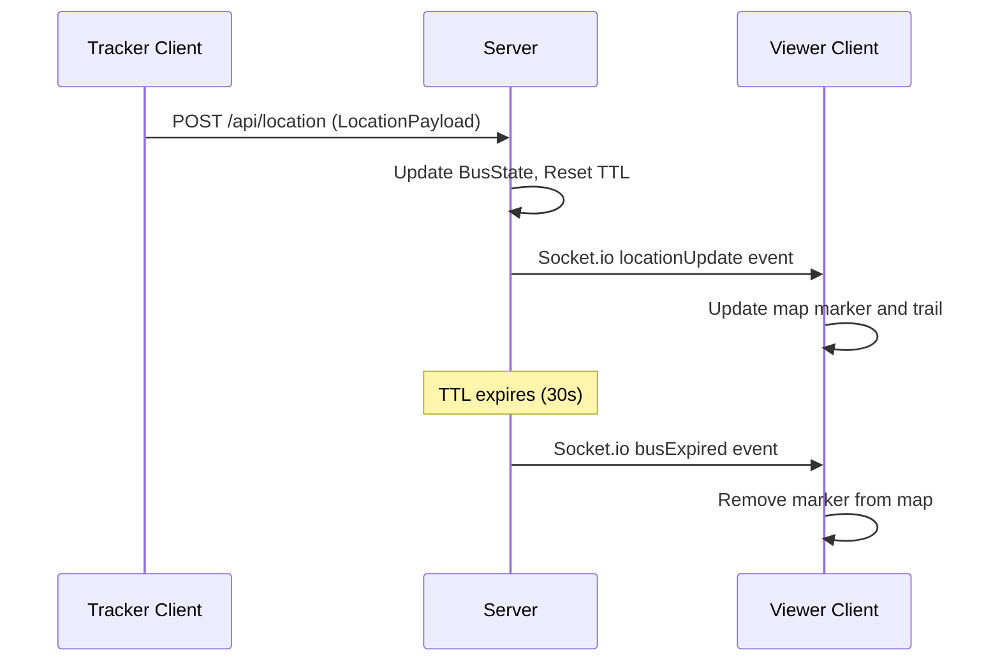

# Design Document

## Overview

TRAX is a production-grade, real-time vehicle tracking web application that combines crowdsourced GPS data with simulated cell tower triangulation fallback. The system architecture follows a client-server model where multiple browser clients can act as either trackers (sharing location) or viewers (observing locations) through a unified web interface.

The application is designed for mobile-first usage with offline resilience, requiring no persistent database storage. All vehicle state is maintained in-memory with TTL-based cleanup, making the system lightweight and suitable for deployment in resource-constrained environments.

Key architectural principles:
- **Stateless HTTP API**: RESTful endpoints for location updates and queries
- **Real-time WebSocket communication**: Socket.io for live location broadcasting
- **In-memory state management**: No database dependencies, TTL-based cleanup
- **Progressive enhancement**: GPS-first with cell tower fallback
- **Offline resilience**: Request queuing and session persistence

## Architecture

### System Components

The TRAX system consists of three primary components:

1. **Node.js Server** (`server.js`)
   - Express.js HTTP server with production middleware stack
   - Socket.io WebSocket server for real-time communication
   - In-memory vehicle state management with TTL cleanup
   - Rate limiting and security hardening

2. **Web Client** (`public/index.html`)
   - Single-page application with Leaflet map integration
   - GPS tracking with cell tower triangulation fallback
   - Real-time status panel and offline queue management
   - Mobile-first responsive design

3. **Static Assets** (`public/` directory)
   - HTML, CSS, and client-side JavaScript
   - Served directly by Express static middleware

### Communication Flow



### Data Flow Architecture

1. **Location Acquisition**: GPS via `navigator.geolocation` or simulated cell tower triangulation
2. **Client Validation**: BusId format validation before network requests
3. **HTTP Transport**: POST requests to `/api/location` with offline queuing
4. **Server Processing**: Validation, state update, TTL management
5. **Real-time Broadcasting**: Socket.io events to subscribed clients
6. **Map Visualization**: Leaflet markers with trails and accuracy circles

## Components and Interfaces

### Server Components

#### HTTP Middleware Stack
- **Helmet**: Security headers (CSP, HSTS, X-Frame-Options)
- **Compression**: Gzip compression for responses
- **Morgan**: HTTP request logging in combined format
- **CORS**: Cross-origin resource sharing (configurable origin)
- **Express Rate Limit**: 10 requests per second per IP for `/api/*`
- **Express JSON**: Request body parsing with size limits

#### State Management
```javascript
// In-memory state structure
const busStates = new Map(); // BusId -> BusState
const ttlTimers = new Map(); // BusId -> setTimeout handle

// BusState structure
{
  busId: string,
  latest: LocationPayload,
  history: LocationPayload[], // Last 5 positions
  lastUpdate: Date
}
```

#### Socket.io Room Management
- **BusRooms**: Named rooms per vehicle (`bus-${busId}`)
- **Subscription Management**: Client join/leave operations
- **Event Broadcasting**: Targeted updates to room subscribers

### Client Components

#### Location Services
```javascript
// GPS tracking with high accuracy
navigator.geolocation.watchPosition(callback, errorCallback, {
  enableHighAccuracy: true,
  timeout: 10000,
  maximumAge: 1000
});

// Cell tower triangulation simulation
const mockTowers = [
  { lat: 26.8917, lng: 80.8862 }, // NW
  { lat: 26.8917, lng: 81.0062 }, // NE
  { lat: 26.8017, lng: 80.8862 }, // SW
  { lat: 26.8017, lng: 81.0062 }  // SE
];
```

#### Map Visualization Engine
- **Leaflet Integration**: OpenStreetMap tiles, zoom level 13
- **Marker Management**: Dynamic creation/update with smooth transitions
- **Trail Rendering**: Polylines through last 5 positions
- **Accuracy Visualization**: Circles for cell tower uncertainty

#### Offline Queue System
```javascript
// localStorage-based queue management
const offlineQueue = {
  key: 'trax_offline_queue',
  maxSize: 50,
  flushInterval: 10000 // 10 seconds
};
```

### API Interfaces

#### REST Endpoints

**POST /api/location**
```json
// Request
{
  "busId": "BUS-101",
  "lat": 26.8467,
  "lng": 80.9462,
  "source": "gps",
  "accuracy": 42,
  "timestamp": "2024-01-15T10:30:00.000Z"
}

// Response (200 OK)
{
  "status": "ok",
  "busId": "BUS-101",
  "latest": { /* LocationPayload */ }
}
```

**GET /api/bus/:busId/location**
```json
// Response (200 OK)
{
  "busId": "BUS-101",
  "latest": { /* LocationPayload */ },
  "history": [ /* Array of LocationPayload */ ],
  "lastUpdate": "2024-01-15T10:30:00.000Z"
}
```

#### Socket.io Events

**Client → Server**
- `subscribe`: `{ "busId": "BUS-101" }` - Join bus room
- `unsubscribe`: `{ "busId": "BUS-101" }` - Leave bus room

**Server → Client**
- `initialState`: Full map of active BusState records
- `locationUpdate`: Updated BusState for specific vehicle
- `busExpired`: `{ "busId": "BUS-101" }` - Vehicle TTL expired

## Data Models

### LocationPayload
```typescript
interface LocationPayload {
  busId: string;        // Alphanumeric + hyphens, max 20 chars
  lat: number;          // Latitude [-90, 90]
  lng: number;          // Longitude [-180, 180]
  source: "gps" | "cell"; // Location acquisition method
  accuracy: number;     // Estimated error radius in meters
  timestamp: string;    // ISO 8601 format
}
```

### BusState
```typescript
interface BusState {
  busId: string;
  latest: LocationPayload;
  history: LocationPayload[]; // Max 5 entries, FIFO
  lastUpdate: Date;
}
```

### MockTower
```typescript
interface MockTower {
  lat: number;
  lng: number;
  id: string; // "NW", "NE", "SW", "SE"
}
```

### Client State
```typescript
interface ClientState {
  isTracking: boolean;
  currentBusId: string | null;
  currentLocation: LocationPayload | null;
  locationSource: "gps" | "cell";
  watchId: number | null;
  sendInterval: number | null;
  offlineQueue: LocationPayload[];
  socketConnected: boolean;
}
```

## Correctness Properties

*A property is a characteristic or behavior that should hold true across all valid executions of a system-essentially, a formal statement about what the system should do. Properties serve as the bridge between human-readable specifications and machine-verifiable correctness guarantees.*

### Property 1: HTTP Middleware Stack Consistency

*For any* HTTP request to the server, the response SHALL include security headers from helmet, appropriate compression when supported by the client, CORS headers allowing the configured origin, and a corresponding log entry in combined format.

**Validates: Requirements 2.1, 2.2, 2.3, 2.4**

### Property 2: Location Payload Validation

*For any* POST request to `/api/location`, if the request body contains invalid data (missing busId, invalid coordinates, malformed busId format), the server SHALL respond with HTTP status 400 and an appropriate error message, regardless of other request characteristics.

**Validates: Requirements 4.2, 4.3, 4.4, 4.5**

### Property 3: Valid Location Processing

*For any* valid LocationPayload sent to `POST /api/location`, the server SHALL respond with status 200, update the BusState with the new location appended to history (capped at 5 entries), reset the TTL timer to 30 seconds, and emit a locationUpdate Socket.io event to the appropriate BusRoom.

**Validates: Requirements 4.1, 4.6, 4.7, 4.8**

### Property 4: BusId Format Validation Consistency

*For any* string used as a busId (in POST body, GET URL path, or client input), the validation SHALL consistently accept only alphanumeric characters and hyphens with maximum length of 20 characters, rejecting all other formats with appropriate error messages.

**Validates: Requirements 4.3, 5.3, 10.2, 10.3, 10.4**

### Property 5: Bus State Retrieval

*For any* GET request to `/api/bus/:busId/location` with a valid busId format, the server SHALL respond with status 200 and the current BusState if the busId exists in memory, or status 404 with error message if the busId does not exist.

**Validates: Requirements 5.1, 5.2**

### Property 6: TTL-Based State Management

*For any* BusState in memory, when 30 seconds elapse without a location update, the server SHALL remove the BusState from memory, emit a busExpired Socket.io event to the BusRoom, and allow new BusState creation if subsequent updates arrive for the same busId.

**Validates: Requirements 6.2, 6.3, 6.4**

### Property 7: Socket.io Room Lifecycle Management

*For any* Socket.io client and busId combination, subscribe events SHALL add the client to the BusRoom, unsubscribe events SHALL remove the client from the BusRoom, new connections SHALL receive initialState with all active BusStates, and disconnections SHALL automatically remove the client from all joined rooms.

**Validates: Requirements 7.1, 7.2, 7.3, 7.4**

### Property 8: Location Source Handling

*For any* location data (GPS or cell tower), the client SHALL correctly set the source field, apply appropriate accuracy values (GPS from navigator.geolocation, cell tower between 500-2000m), and include proper Gaussian noise (±0.005°) for cell tower positions.

**Validates: Requirements 8.2, 8.4, 9.5, 9.6, 9.7**

### Property 9: Map Visualization Synchronization

*For any* locationUpdate Socket.io event received, the client SHALL update existing markers with smooth transitions, create new markers for new busIds, maintain polyline trails through the last 5 positions, display accuracy circles for cell tower sources, and remove all map elements when busExpired events are received.

**Validates: Requirements 11.2, 11.3, 11.4, 11.5, 11.6, 11.7, 11.8**

### Property 10: Marker Popup Information Completeness

*For any* vehicle marker on the map, clicking the marker SHALL display a popup containing all required information: busId, coordinates (5 decimal places), source type, accuracy value, and last update timestamp.

**Validates: Requirements 11.9**

### Property 11: Status Panel Data Accuracy

*For any* application state change (tracking start/stop, location source change, accuracy update, timestamp update), the status panel SHALL reflect the current values accurately with proper formatting (accuracy in metres, timestamps in local time format).

**Validates: Requirements 12.3, 12.4**

### Property 12: Offline Queue Management

*For any* failed POST request during tracking, the LocationPayload SHALL be added to the offline queue (capped at 50 entries with FIFO eviction), queued entries SHALL be retried every 10 seconds while tracking is active, successful retries SHALL remove entries from the queue, and failed retries SHALL leave entries for the next cycle.

**Validates: Requirements 13.1, 13.2, 13.3, 13.4, 13.6**

### Property 13: Session Persistence Round-Trip

*For any* successful location update, the busId and LocationPayload SHALL be persisted to localStorage, and on page load, stored values SHALL be restored to pre-populate the busId input field and render cached markers with appropriate session restoration messages.

**Validates: Requirements 14.1, 14.2, 14.3, 14.4**

### Property 14: Socket.io Reconnection Behavior

*For any* Socket.io disconnection and subsequent reconnection, the client SHALL automatically re-emit subscribe events for the currently tracked busId to rejoin the appropriate BusRoom and resume receiving location updates.

**Validates: Requirements 16.4**

### Property 15: JSON Serialization Round-Trip Integrity

*For any* valid LocationPayload object, serializing to JSON string and parsing back SHALL produce an object with identical busId, lat, lng, source, accuracy, and timestamp fields, with lat/lng values equal within floating-point precision (delta ≤ 1e-9).

**Validates: Requirements 17.2, 17.3, 17.4**

## Error Handling

### Server-Side Error Handling

#### Input Validation Errors
- **Invalid BusId Format**: HTTP 400 with descriptive error message
- **Missing Required Fields**: HTTP 400 with field-specific error message  
- **Coordinate Range Errors**: HTTP 400 with range validation message
- **Malformed JSON**: HTTP 400 with parsing error message

#### Rate Limiting
- **Request Throttling**: HTTP 429 after 10 requests per second per IP
- **Graceful Degradation**: Rate-limited clients receive clear error messages

#### Resource Management
- **Memory Pressure**: TTL-based cleanup prevents unbounded state growth
- **Socket Connection Limits**: Automatic cleanup on client disconnect
- **Graceful Shutdown**: SIGINT/SIGTERM handling with connection draining

#### WebSocket Error Handling
- **Connection Failures**: Automatic reconnection with exponential backoff
- **Room Management Errors**: Silent failure with logging for debugging
- **Event Emission Failures**: Non-blocking with error logging

### Client-Side Error Handling

#### GPS and Location Services
- **Permission Denied**: Immediate fallback to cell tower simulation
- **Position Unavailable**: Automatic fallback with user notification
- **Timeout Errors**: Retry with cell tower fallback after timeout
- **Accuracy Degradation**: Visual indicators for location uncertainty

#### Network and Connectivity
- **Request Failures**: Automatic queuing in localStorage-backed offline queue
- **WebSocket Disconnection**: Status panel updates with reconnection attempts
- **Server Unavailability**: Offline queue accumulation with retry logic
- **Partial Failures**: Individual request retry without affecting ongoing tracking

#### User Input Validation
- **Empty BusId**: Clear error message with input focus
- **Invalid Characters**: Real-time validation with format guidance
- **Length Violations**: Character count display with limit enforcement
- **Format Errors**: Inline validation with correction suggestions

#### Browser Compatibility
- **Geolocation API Unavailability**: Graceful degradation to cell tower mode
- **LocalStorage Failures**: Continue operation without persistence
- **WebSocket Unsupported**: Fallback to polling (if implemented)
- **Map Rendering Issues**: Error boundaries with fallback UI

### Error Recovery Strategies

#### Automatic Recovery
- **Network Reconnection**: Automatic queue flushing when connectivity restored
- **GPS Recovery**: Automatic switch back from cell tower when GPS available
- **WebSocket Reconnection**: Exponential backoff with room re-subscription
- **State Synchronization**: Initial state fetch on reconnection

#### User-Initiated Recovery
- **Manual Refresh**: Clear error states and reinitialize services
- **Force Cell Tower**: Manual fallback when GPS is problematic
- **Clear Cache**: Reset localStorage state for troubleshooting
- **Restart Tracking**: Clean state reset for error recovery

## Testing Strategy

### Dual Testing Approach

The TRAX system requires comprehensive testing using both property-based testing for universal behaviors and example-based testing for specific scenarios and integrations.

#### Property-Based Testing

**Framework**: fast-check (JavaScript property-based testing library)
**Configuration**: Minimum 100 iterations per property test
**Coverage**: All 15 correctness properties defined in this document

Each property test will be tagged with a comment referencing the design property:
```javascript
// Feature: trax-vehicle-tracker, Property 1: HTTP Middleware Stack Consistency
```

**Property Test Categories**:
1. **Input Validation Properties**: Test validation logic across all possible invalid inputs
2. **State Management Properties**: Test TTL cleanup, BusState lifecycle, and memory management
3. **Communication Properties**: Test WebSocket room management and event broadcasting
4. **Serialization Properties**: Test JSON round-trip integrity for all data structures
5. **Client Behavior Properties**: Test location handling, offline queuing, and UI synchronization

#### Unit Testing

**Framework**: Jest (JavaScript testing framework)
**Focus Areas**:
- Specific error conditions and edge cases
- UI interaction behaviors (button clicks, form validation)
- Configuration validation (package.json, environment variables)
- Integration points between components
- Browser API mocking (geolocation, localStorage, WebSocket)

**Unit Test Categories**:
1. **Configuration Tests**: Verify package.json structure, environment variable handling
2. **Middleware Tests**: Test individual Express middleware configuration
3. **UI Interaction Tests**: Test button behaviors, form validation, status updates
4. **Error Handling Tests**: Test specific error scenarios and recovery
5. **Integration Tests**: Test component interactions and API contracts

#### Integration Testing

**Scope**: End-to-end workflows and external service integration
**Test Scenarios**:
- Complete tracking workflow (start → GPS → location updates → stop)
- WebSocket connection lifecycle with multiple clients
- Offline queue behavior during network outages
- Map visualization with real location data
- Cell tower fallback simulation accuracy

#### Performance Testing

**Load Testing**: Multiple concurrent trackers and viewers
**Memory Testing**: TTL cleanup effectiveness under load
**Network Testing**: Offline queue behavior and recovery
**Mobile Testing**: Touch interaction and responsive layout validation

### Test Data Generation

#### LocationPayload Generation
```javascript
// Property test generators
const validLocationPayload = fc.record({
  busId: fc.stringOf(fc.constantFrom(...'ABCDEFGHIJKLMNOPQRSTUVWXYZabcdefghijklmnopqrstuvwxyz0123456789-'), {minLength: 1, maxLength: 20}),
  lat: fc.float({min: -90, max: 90}),
  lng: fc.float({min: -180, max: 180}),
  source: fc.constantFrom('gps', 'cell'),
  accuracy: fc.float({min: 1, max: 10000}),
  timestamp: fc.date().map(d => d.toISOString())
});

const invalidBusId = fc.oneof(
  fc.string().filter(s => !/^[a-zA-Z0-9-]{1,20}$/.test(s)),
  fc.stringOf(fc.char(), {minLength: 21})
);
```

#### Mock Services
- **GPS Simulation**: Controlled geolocation API responses
- **Network Simulation**: Configurable request success/failure rates
- **WebSocket Simulation**: Controlled connection/disconnection scenarios
- **Timer Simulation**: Accelerated TTL testing for rapid validation

### Continuous Integration

**Pre-commit Hooks**: 
- Property test execution (fast subset)
- Unit test execution
- Linting and code formatting
- Security vulnerability scanning

**CI Pipeline**:
1. **Fast Feedback**: Unit tests and quick property tests (< 2 minutes)
2. **Comprehensive Testing**: Full property test suite (100+ iterations)
3. **Integration Testing**: End-to-end scenarios with real browser automation
4. **Performance Validation**: Load testing and memory leak detection

**Test Environment Requirements**:
- Node.js 18+ for server testing
- Modern browser automation (Playwright/Puppeteer) for client testing
- Network simulation capabilities for offline testing
- Mobile device simulation for responsive testing

This dual testing approach ensures both correctness (via property-based testing) and practical functionality (via example-based testing), providing comprehensive coverage for the TRAX vehicle tracking system.